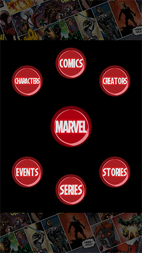
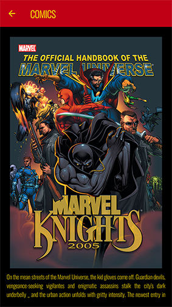

# Marvel Project

Welcome to the Marvel Project! This is an Android app development project that utilizes Kotlin and Jetpack Compose to provide a unique experience related to the Marvel universe.

## Description

The Marvel Project aims to create an application that allows users to explore information about Marvel characters, comics, and movies. The app leverages the power of Kotlin and Jetpack Compose to create a modern and engaging user interface.

## Video Introduction

Check out the project introduction video on YouTube:

## Features

- Exploration of Marvel characters, comics, and movies.
- Detailed details of each element, including popular characters, comic storylines, and more.
- Intuitive and attractive user interface created with Jetpack Compose.
- Integration with the Marvel API to fetch updated data.

## Screenshots

## Setup

1. Clone this repository to your local machine.
2. Open the project in Android Studio.
3. Add your api public and private keys to keys.c file
4. Build and run the application on a device or emulator.

## Credits

- Marvel API: [Official Marvel Website](https://developer.marvel.com)

## Contact
[LinkedIn](https://www.linkedin.com/in/davidlunacervantes/)

If you have any questions or suggestions about the project, feel free to get in touch with me via my email address: [Email](voxel.mail@gmail.com)

